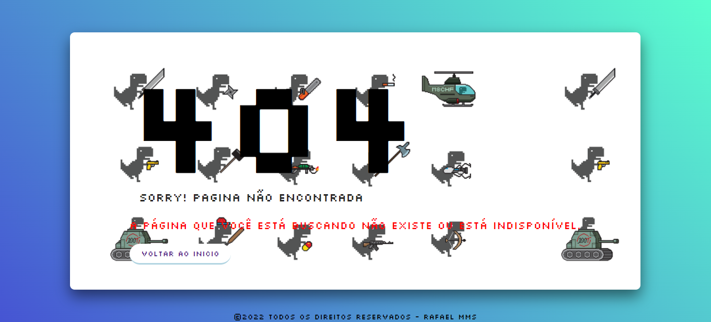

## Sobre:

Desafio do dia 5, cujo o objetivo era desenvolver uma página que exiba o erro 404, aproveitei que já havia desenvolvido essa, ai aproveitei o código para fazer o desafio, ela está interativa ou seja quando o usuário movimenta o mouse a imagem de fundo do Dino Chrome também se movimenta.
 

<a href="https://rafamms013.github.io/Pagina-erro-404/">

## Tecnologias usadas:
<li>HTML</li>
<li>CSS</li>
<li>JavaScript</li>

## IDE usada:
<li>Visual Studio Code</li>

## Referências:
<li>Canal no YouTube: Online Tutorials</li>
<li>Imagem usada no ícone e background: Google imagens</li>
